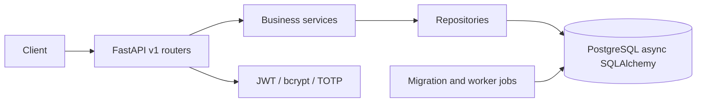

# hinbert-fastapi

`hinbert-fastapi` is a reusable FastAPI foundation for PyPI distribution or a private GitHub package. It separates HTTP endpoints, services, repositories, and SQLAlchemy models so teams can scale ownership without moving contracts.

## Architecture

## Quick Start

1. Clone the repository and enter it: `git clone <repository-url> && cd hinbert-fastapi`.
2. Create a virtual environment: `python -m venv .venv` and activate it with `.venv\\Scripts\\Activate.ps1` on Windows or `source .venv/bin/activate` on Unix.
3. Install development dependencies: `pip install -r requirements-dev.txt`.
4. Create local configuration: `Copy-Item .env.example .env` on Windows or `cp .env.example .env` on Unix. Replace development secrets before any shared deployment.
5. Apply migrations: `alembic upgrade head`.
6. Seed development records: `python scripts/seed_data.py`.
7. Start the server: `uvicorn app.main:app --reload`.
8. Open `/docs` or `/redoc` for generated API documentation.
9. Run tests: `pytest -v`.

For local PostgreSQL and Redis instead, run `docker compose -f docker/docker-compose.yml up -d postgres redis`, set `DATABASE_URL` in `.env`, then run the migration and seed commands.

## Security and customization

Access tokens are short-lived JWTs. Refresh credentials are opaque and only their SHA-256 digest belongs in the database. Add migrations for all domain tables before production, encrypt TOTP secrets with a KMS, configure trusted CORS origins, and use a distributed SlowAPI storage backend when running multiple replicas. OAuth provider exchange and email delivery are explicit integration boundaries.

## Quality and deployment

Run `pytest --cov=app --cov-fail-under=80`, `ruff check .`, `black --check .`, `isort --check-only .`, and `mypy app`. Build with `docker build -f docker/Dockerfile .`; the Helm chart is under `docker/kubernetes`. Publish to PyPI with a trusted publisher or install the same package from a private GitHub registry.