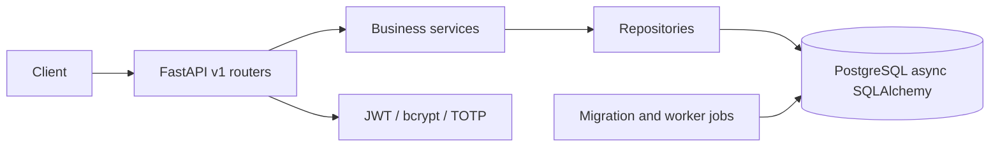

# hinbert-fastapi

`hinbert-fastapi` is a reusable FastAPI foundation for PyPI distribution or a private GitHub package. It separates HTTP endpoints, services, repositories, and SQLAlchemy models so teams can scale ownership without moving contracts.

## Architecture

## Setup

1. Create a virtual environment and install `requirements-dev.txt`.
2. Copy `.env.example` to `.env` and replace `HINBERT_JWT_SECRET_KEY` with a secret-manager value.
3. Start local dependencies with `docker compose -f docker/docker-compose.yml up -d postgres redis`.
4. Run `python scripts/run_migrations.py`, then `uvicorn app.main:app --reload`.
5. Open `/docs` or `/redoc` for generated API documentation.

## Security and customization

Access tokens are short-lived JWTs. Refresh credentials are opaque and only their SHA-256 digest belongs in the database. Add migrations for all domain tables before production, encrypt TOTP secrets with a KMS, configure trusted CORS origins, and use a distributed SlowAPI storage backend when running multiple replicas. OAuth provider exchange and email delivery are explicit integration boundaries.

## Quality and deployment

Run `pytest --cov=app --cov-fail-under=80`, `ruff check .`, `black --check .`, `isort --check-only .`, and `mypy app`. Build with `docker build -f docker/Dockerfile .`; the Helm chart is under `docker/kubernetes`. Publish to PyPI with a trusted publisher or install the same package from a private GitHub registry.