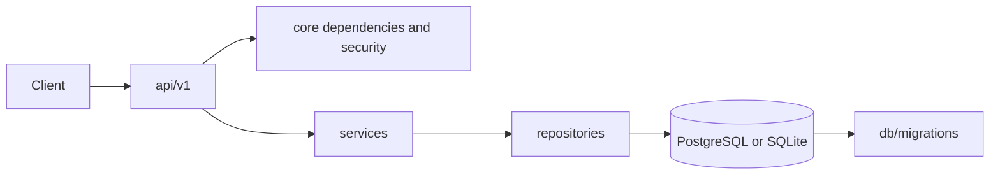

# Architecture

## Overview

Hinbert FastAPI uses a layered architecture. HTTP concerns stop at `api/`; business rules live in `services/`; SQLAlchemy access is isolated in `repositories/`.

## Layer Responsibilities

| Layer | Responsibility | Typical files |
|---|---|---|
| `api/` | Routing, validation, response envelopes, dependency injection | `endpoints/*.py`, `deps/*.py` |
| `core/` | Settings, JWT/bcrypt/TOTP primitives, middleware, domain exceptions | `core/security`, `core/middleware` |
| `models/` | Persistence mappings and Pydantic request/response contracts | `models/domain`, `models/schemas` |
| `services/` | Business workflows and external-service boundaries | `services/*.py` |
| `repositories/` | Parameterized queries and persistence operations | `repositories/*.py` |
| `db/` | Async engine/session setup and Alembic metadata | `db/session.py`, `db/migrations` |

## Request Flow

1. Uvicorn imports `app.main:app`.
2. `create_app()` loads validated settings, middleware, exception handlers, rate limiting, and versioned routers.
3. FastAPI validates path, query, and JSON input with Pydantic.
4. Dependencies resolve the database session and, for protected routes, decode the bearer access token.
5. The endpoint coordinates a service or repository operation.
6. SQLAlchemy executes parameterized statements through the async session.
7. The endpoint returns `APIResponse`, and Pydantic serializes only the declared response fields.
8. Middleware adds security headers and structured timing logs.

## Authentication Flow

- Signup creates a bcrypt password hash and a SHA-256 email-verification token digest.
- Login verifies bcrypt credentials and issues a short-lived JWT access token plus an opaque refresh token. Only the refresh token digest is persisted.
- Refresh checks digest, expiry, revocation, and account state, then revokes the old record and creates a replacement.
- Logout revokes the supplied refresh-token record.
- Verification and reset tokens are expiring, hashed, and single-use.
- TOTP secrets are Fernet-encrypted using a key derived from the application secret; provisioning uses a standard `otpauth://` URI.
- OAuth callbacks exchange provider codes, normalize the profile, provision an account when needed, and issue the normal token pair.

## Security Model

CORS origins come from settings. SlowAPI decorators protect each route and return the standard 429 envelope. SQLAlchemy expressions bind user values instead of concatenating SQL. Passwords and bearer tokens are never logged. Response middleware adds `X-Content-Type-Options`, `X-Frame-Options`, `Referrer-Policy`, and `Permissions-Policy`.

## Technology Decisions

- FastAPI provides typed async routing and generated OpenAPI.
- Pydantic v2 centralizes validation and environment parsing.
- SQLAlchemy 2.x provides async sessions, ORM mappings, and database portability.
- PostgreSQL is the production relational store; SQLite/aiosqlite keeps local tests quick.
- Alembic makes schema evolution reviewable and reversible.
- JWT access tokens avoid a database lookup for every request; refresh records preserve revocation control.
- bcrypt is deliberately used for password hashing; Fernet protects TOTP secrets at rest.
- Redis is available for distributed rate-limit storage and future background work.
